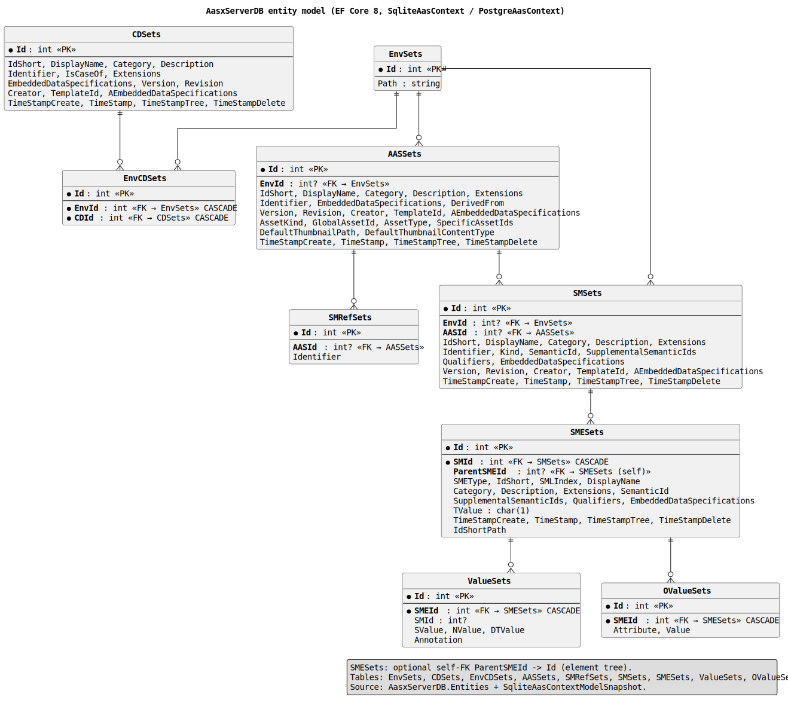

# AAS on a Relational Database

> How the AASPE Server stores an Asset Administration Shell (AAS) environment in a
> relational database and how AASQL queries are translated into SQL.

This document is intended for contributors who want to understand, debug, or extend
`AasxServerDB` and the AASQL query path in `AasxServerDB/Query.cs`.

- Entity model (EF Core 8): `src/AasxServerDB/Entities/*.cs`
- Query pipeline:            `src/AasxServerDB/Query.cs`
- Structured conditions:     `src/Contracts/SqlConditions.cs`
- AASQL parser:              `src/Contracts/QueryParserJSON.cs`

The persisted schema is the same for SQLite and PostgreSQL; differences are limited
to the EF Core `DbContext` (`SqliteAasContext` / `PostgreAasContext`) and a few
SQLite-specific SQL rewrites (e.g. `LIKE`→`GLOB`, `instr(...)`→`LIKE`).

---

## 1. Entity model



The AAS metamodel is a **tree** (Environment → AAS → Submodel → SubmodelElement → Value),
but a relational store needs flat tables with foreign keys. The mapping is:

| AAS concept                | Table (entity class)           | Notes                                                                                   |
|----------------------------|--------------------------------|-----------------------------------------------------------------------------------------|
| Environment (AASX file)    | `EnvSets` (`EnvSet`)           | One row per loaded AASX, `Path` points to the original file.                            |
| Asset Administration Shell | `AASSets` (`AASSet`)           | Keyed by `Id` (int PK); business key is `Identifier`.                                   |
| AAS → Submodel reference   | `SMRefSets` (`SMRefSet`)       | `AASId` + `Identifier` (the SM identifier). Many-to-many via AAS identifier lookup.     |
| Submodel                   | `SMSets` (`SMSet`)             | Standalone row, linked to AAS only via `SMRefSets.Identifier` = `SMSets.Identifier`.    |
| SubmodelElement (any type) | `SMESets` (`SMESet`)           | `SMId` points to the Submodel. `ParentSMEId` makes the SME tree explicit (nullable).   |
| Value of an SME            | `ValueSets` (`ValueSet`)       | `SMEId` points to the SME. Holds `SValue` / `NValue` / `DTValue` + `Annotation`.        |
| Extra / overflow values    | `OValueSets` (`OValueSet`)     | Used where `ValueSet` is not enough (e.g. multi-language strings, operation variables). |
| ConceptDescriptions        | `CDSets` (`CDSet`)             | Identified by `Identifier`; referenced by `EnvCDSets` per environment.                  |
| Environment ↔ CD           | `EnvCDSets` (`EnvCDSet`)       | N:M link between an environment and the concept descriptions it ships.                  |

Indexes that matter for the query path (see `SMESet.cs`):

```csharp
[Index(nameof(SMId))]
[Index(nameof(ParentSMEId))]
[Index(nameof(SemanticId))]
[Index(nameof(IdShort))]
[Index(nameof(IdShortPath))]
[Index(nameof(SMId), nameof(IdShort), nameof(IdShortPath))]
```

### 1.1 Flattening the SME tree — `IdShortPath`

`SMESet` stores **both** the parent reference (`ParentSMEId`) *and* a denormalised
dotted path string (`IdShortPath`) such as `Records[0].DateOfRecord` or
`Nameplate.ContactInformation.Phone`. Collections use `[i]` segments.

- `ParentSMEId` keeps the exact model tree — it is used by import/export and by the
  recursive CTE in `SearchSMEs` when a caller asks to *reconstruct* the path from
  the tree (`BuiltIdShortPath` in `Query.cs`).
- `IdShortPath` is the workhorse for **queries** — single indexed string column,
  no recursion needed at query time. Almost every AASQL path condition resolves
  to a predicate on this column.

Both representations are kept in sync on write; reads prefer `IdShortPath` because
it avoids a recursive CTE per query.

---

## 2. From AASQL to SQL — the pipeline

```
  AASQL text  ──►  QueryGrammarJSON (Irony)  ──►  SqlConditions  ──►  CombineTablesLEFT  ──►  SQL (SQLite / Postgres)
                     src/Contracts/                  src/Contracts/     src/AasxServerDB/
                     QueryParserJSON.cs              SqlConditions.cs   Query.cs
```

The parser does *not* emit a single WHERE clause. It emits a **structured**
`SqlConditions` object with:

| Property                       | Meaning                                                                                          |
|--------------------------------|--------------------------------------------------------------------------------------------------|
| `FormulaConditions["aas" \| "sm" \| "sme" \| "value"]` | Per-scope WHERE fragments, used to pre-filter each table before joining.          |
| `FormulaConditions["all"]`     | The overall boolean expression, containing placeholders `$$path{n}$$`, `$$match{n}$$`, `$$exists{n}$$`. |
| `FilterConditions[...]`        | Same scopes, but populated from access-rule FILTER blocks (security).                            |
| `Paths` : `List<PathJoin>`     | Subquery bodies for every path condition outside `$match`.                                       |
| `Matches` : `List<MatchJoin>`  | Groups of paths that must hit the *same array element* (from `$match`).                          |
| `ExistsConditions`             | Correlated `EXISTS` predicates (from direct `$sme#value` subtrees).                              |
| `Select`                       | Projection hint (`id`, `match`, …).                                                              |

Security rules are **merged** into the user query via
`SqlConditionsMerger.Merge` / `OrMerge`, which re-numbers placeholders so every
`$$path{n}$$` / `$$match{n}$$` / `$$exists{n}$$` stays unambiguous in the final
`all` expression.

---

## 3. `CombineTablesLEFT` — assembling the SQL

`CombineTablesLEFT` (in `Query.cs`) is the single place that turns a
`SqlConditions` instance into a raw SQL string, executes it via
`FromSqlRaw`, and returns the matching submodel (or AAS) ids.

The structure is always:

```
SELECT DISTINCT <sm.Id | aas.Id>
FROM  (AAS subquery)            -- optional, only if AAS scope is restricted
JOIN   SMRefSets                 -- optional, glue to SM via Identifier
JOIN  (SM subquery)
LEFT JOIN (path subquery)  AS p1 ON p1.SMId = sm.Id
LEFT JOIN (path subquery)  AS p2 ON p2.SMId = sm.Id
LEFT JOIN (match subquery) AS m1 ON m1.SMId = sm.Id
LEFT JOIN (sme aggregate)  AS sme   ON sme.SMId   = sm.Id   -- optional
LEFT JOIN (value aggregate) AS value ON value.SMId = sm.Id  -- optional
WHERE <overall expression with placeholders resolved>
ORDER BY sm.Id
LIMIT ... OFFSET ...
```

### 3.1 AAS / SM subqueries

Per-scope filters are inlined as *nested selects*, not as direct WHERE predicates.
This keeps each scope cheap and lets the optimizer drive from the smallest set:

```sql
FROM (
  SELECT Id, Identifier FROM AASSets
  WHERE <FormulaConditions["aas"] AND FilterConditions["aas"]>
) AS aas
INNER JOIN SMRefSets AS sx ON aas.Id = sx.AASId
INNER JOIN (
  SELECT Id, IdShort, Identifier FROM SMSets
  WHERE <FormulaConditions["sm"] AND FilterConditions["sm"]>
) AS sm ON sx.Identifier = sm.Identifier
```

The AAS join is skipped entirely when the AAS scope is a pure tautology
(`1=1`) **and** the overall expression does not mention `"aas".`.

### 3.2 Path conditions — `$$path{n}$$`

Every standalone `$sme.idShortPath#field op value` in AASQL produces one
`PathJoin` in `SqlConditions.Paths` and one placeholder `$$path{n}$$` in
`FormulaConditions["all"]`.

`CombineTablesLEFT` expands it to:

```sql
LEFT JOIN (
  SELECT sme.SMId AS SMId
  <PathJoin.SubquerySql>         -- FROM SMESets sme [LEFT JOIN ValueSets v ON ...] WHERE ...
) AS p{n} ON p{n}.SMId = sm.Id
```

and rewrites the placeholder to `(p{n}.SMId IS NOT NULL)` — i.e. "there exists
at least one SME row for this submodel that satisfies the condition".

A typical `SubquerySql` body (built by `QueryParserJSON.TryBuildPathSubquerySql`)
is:

```sql
FROM SMESets sme
LEFT JOIN ValueSets v ON v.SMEId = sme.Id
WHERE "sme"."IdShortPath" GLOB 'Records[*].DateOfRecord'
  AND "v"."DTValue" >= '2024-01-01'
```

### 3.3 `$match` — recursive aliases for the *same* array element

`$match` is the interesting part. Example:

```aasql
$match(
  $sme.Records[].DateOfRecord >= 2024-01-01,
  $sme.Records[].Value        >  42
)
```

The two conditions must hit the **same** `Records[i]` element, not just
*any* two elements in the same submodel. `SqlConditions.Matches` represents this
as one `MatchJoin` whose `Paths` list is the two sub-paths. Rendering happens
in `BuildMatchSubquerySql`:

```sql
SELECT Path1.SMId AS SMId
FROM (
  SELECT smePath1.SMId AS SMId,
         substr(smePath1.IdShortPath, ...) AS Part1_1_1    -- "Records[<index>]" substring
  FROM SMESets smePath1 LEFT JOIN ValueSets v ON v.SMEId = smePath1.Id
  WHERE "smePath1"."IdShortPath" GLOB 'Records[*].DateOfRecord'
    AND "v"."DTValue" >= '2024-01-01'
) AS Path1
JOIN (
  SELECT smePath2.SMId AS SMId,
         substr(smePath2.IdShortPath, ...) AS Part1_1_2
  FROM SMESets smePath2 LEFT JOIN ValueSets v ON v.SMEId = smePath2.Id
  WHERE "smePath2"."IdShortPath" GLOB 'Records[*].Value'
    AND "v"."NValue" > 42
) AS Path2
WHERE (Path1.SMId = Path2.SMId)
  AND (Part1_1_1 = Part1_1_2)      -- same [i] in "Records[i]"
```

Naming convention used internally:

| Alias                  | Role                                                                             |
|------------------------|----------------------------------------------------------------------------------|
| `smePath{k}`           | Per-path `SMESets` alias inside a match group (`k` = 1..N).                      |
| `Path{k}`              | Wrapping derived table that exposes `SMId` + `Part*` substring columns.          |
| `Part1_{s}_{k}`        | Substring of the `[]` section `s` in path `k` (array-index match mode).          |
| `Part1_{p+1}_{s+1}`    | Substring between `%` placeholders in path `p` (template match mode).           |
| `p{n}` / `m{n}`        | Outer LEFT JOIN aliases for `Paths[n-1]` / `Matches[n-1]`.                       |

The match subquery is itself wrapped as a `LEFT JOIN (...) AS m{n}` on the outer
select, and its placeholder `$$match{n}$$` becomes `(m{n}.SMId IS NOT NULL)`.

> The `substr(... instr(..., '{start}') + len, instr(..., '{end}') − ...)` trick
> is the *only* place in the current pipeline that still emits `instr(...)`.
> It extracts the array index (`[i]`) or the `%`-delimited segment from
> `IdShortPath` as a derived column (`Part1_{s}_{k}`) so the outer `WHERE`
> can compare them across paths. This is unrelated to the legacy EF Core
> `instr(...)` post-processing (see §3.7).

### 3.4 `EXISTS` — correlated value predicates

A direct `$sme#value = ...` (a value predicate without an explicit path) becomes
an `ExistsCondition` and expands to a correlated `EXISTS`, not an outer join
(see `BuildValueExistsSql`):

```sql
EXISTS (
  SELECT 1
  FROM ValueSets v
  JOIN SMESets sme_value ON sme_value.Id = v.SMEId
  WHERE sme_value.SMId = sm.Id
    AND (<predicate on v.SValue / v.NValue / v.DTValue / v.Annotation>)
)
```

Correlation is preferred here because these predicates are "does any value on
this submodel match?" — an outer LEFT JOIN would multiply rows and force an
extra `DISTINCT`.

### 3.5 SME / Value aggregate LEFT JOINs

If the overall expression mentions `"sme".` or `"value".` *directly* (i.e. outside
a `Path` / `Match` / `EXISTS`), `CombineTablesLEFT` adds aggregate LEFT JOIN
subqueries so those references are legal in the outer WHERE:

```sql
LEFT JOIN (
  SELECT DISTINCT sme_inner.SMId AS SMId, sme_inner."SemanticId" AS "SemanticId"
  FROM SMESets sme_inner
  WHERE <FilterConditions["sme"]>
) AS sme ON sme.SMId = sm.Id
```

An analogous block exists for `ValueSets` (`value`). After insertion, the
`"v"."SValue"` references in `overall` are rewritten to `"value"."SValue"` so
they resolve against the aggregate alias.

### 3.6 Fast paths and mode flags

Two optimisations sit before the general assembly:

1. **Direct SME** — no paths/matches, no AAS join, only `"sme".` references:
   drive the query from `SMESets` and `JOIN SMSets` on top. Same for **Direct Value**.
2. **`$UNION` / `$TEMPTABLE` flags** — when the overall expression contains top-level
   `OR`s, `SplitTopLevelOr` splits them and each branch runs as an independent
   `SELECT` (either `UNION`ed, or merged into a temp table `union_ids`). This
   lets each branch use its own index instead of a single hard-to-optimise
   `OR`-chain.

### 3.7 SQLite-specific rewrites

At the very end of assembly, `ApplyLikeToGlob` converts `LIKE` with `%`
wildcards to `GLOB` with `*`, so SQLite can use `IdShortPath`'s GLOB-capable
index.

> **Historical note — `instr(...)` is no longer post-processed.**
> Earlier versions built SQL indirectly via LINQ/EF Core, which translated
> `string.Contains` / `StartsWith` on `ValueSet.Annotation` to
> `instr("v"."Annotation", 'needle') > 0` (resp. `= 1`). Helpers
> `ChangeINSTRToLIKE` / `ModifiyRawSQL` / `NormalizeValueAnnotationInstrForCombineSql`
> rewrote those fragments back to `LIKE`. Since the parser now emits SQL
> directly into `SqlConditions`, those helpers became unused and have been
> removed. Any `instr(` that appears in generated SQL today comes from
> `BuildMatchSubquerySql` (see §3.3) and is deliberate — not a leftover from
> the old C#→SQL path.

---

## 4. Walk-through example

AASQL:

```
$sm.semanticId = 'https://admin-shell.io/zvei/nameplate/2/0/Nameplate'
AND $match(
  $sme.ContactInformation.Phone[].TelephoneType  = 'office',
  $sme.ContactInformation.Phone[].TelephoneNumber > ''
)
```

`SqlConditions` after parsing (simplified):

```
FormulaConditions:
  sm   : "sm"."SemanticId" = 'https://.../Nameplate'
  all  : $$match0$$
Matches[0]:
  Paths[0] (smePath1) : IdShortPath GLOB 'ContactInformation.Phone[*].TelephoneType'   AND v.SValue = 'office'
  Paths[1] (smePath2) : IdShortPath GLOB 'ContactInformation.Phone[*].TelephoneNumber' AND v.SValue <> ''
```

`CombineTablesLEFT` output (simplified):

```sql
SELECT DISTINCT sm.Id
FROM (
  SELECT Id, IdShort, Identifier FROM SMSets
  WHERE "SemanticId" = 'https://.../Nameplate'
) AS sm
LEFT JOIN (
  SELECT Path1.SMId AS SMId
  FROM (
    SELECT smePath1.SMId AS SMId,
           substr(smePath1.IdShortPath, ...) AS Part1_1_1
    FROM SMESets smePath1
    LEFT JOIN ValueSets v ON v.SMEId = smePath1.Id
    WHERE "smePath1"."IdShortPath" GLOB 'ContactInformation.Phone[*].TelephoneType'
      AND "v"."SValue" = 'office'
  ) AS Path1
  JOIN (
    SELECT smePath2.SMId AS SMId,
           substr(smePath2.IdShortPath, ...) AS Part1_1_2
    FROM SMESets smePath2
    LEFT JOIN ValueSets v ON v.SMEId = smePath2.Id
    WHERE "smePath2"."IdShortPath" GLOB 'ContactInformation.Phone[*].TelephoneNumber'
      AND "v"."SValue" <> ''
  ) AS Path2
  WHERE (Path1.SMId = Path2.SMId)
    AND (Part1_1_1 = Part1_1_2)
) AS m1 ON m1.SMId = sm.Id
WHERE (m1.SMId IS NOT NULL)
ORDER BY sm.Id LIMIT 100 OFFSET 0
```

---

## 5. Debugging aids

- The generated SQL per request is captured in `QueryResult.Sql`
  (see `SearchSMs` in `Query.cs`) — surface it in API responses while diagnosing.
- `GetQueryPlan` runs `EXPLAIN QUERY PLAN` on SQLite for each raw statement and
  is a good first check when a query is slow (missing index, accidental scan).
- `$TEMPTABLE` is often the fastest way to stabilise plans for large OR-chains;
  `$UNION` is the portable equivalent.

## 6. Further reading

- `src/AasxServerDB/Query.cs` — start at `SearchSMs`, then `CombineTablesLEFT`,
  then `BuildRawSqlFromSqlConditions` and `BuildMatchSubquerySql`.
- `src/Contracts/SqlConditions.cs` — the data structure that everything above
  operates on, including `SqlConditionsMerger` for security-rule merging.
- `src/Contracts/QueryParserJSON.cs` — AASQL → `SqlConditions` (Irony grammar).
