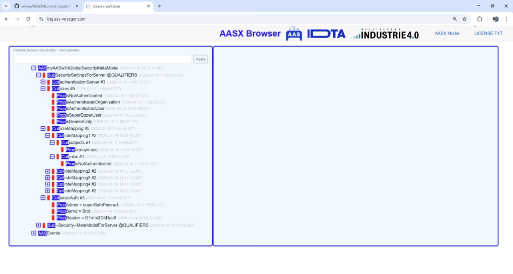
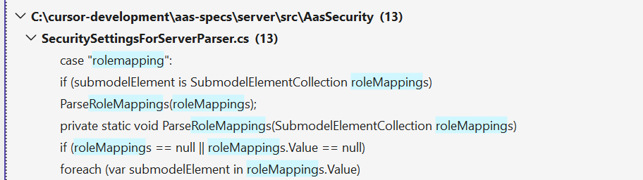

# AAS Server Security

> How authentication, roles, and access rules are configured in the AASPE Server,
> and where to see them live on the reference demo.

This document is a companion to [`database-and-query.md`](database-and-query.md):
the database side explains how submodels are stored and queried, this page
explains **who** is allowed to see what and **how** that filtering is expressed.

Relevant source:

- `src/AasSecurity/SecurityHelper.cs`               — bootstrap / dispatch per submodel `idShort`
- `src/AasSecurity/SecuritySettingsForServerParser.cs` — parses `SecuritySettingsForServer` (auth server, role mappings, basic auth, trustlist)
- `src/AasSecurity/SecurityMetamodelParser.cs`      — parses the legacy ABAC metamodel (`accessControlPolicyPoints` → `PolicyAdministrationPoint` → `AccessPermissionRules`)
- `src/AasxServerBlazor/Pages/Access.razor`         — renders the live `AllAccessPermissionRules` JSON at `/Access`
- `src/AasxServerBlazor/accessrules.txt`            — default rule set served by `/Access`
- `src/AasxServerBlazor/jsonschema-access.txt`      — JSON Schema of the AAS Access Rule Language (shared with the query language)
- `src/Contracts/ContractSecurityRule.cs`           — `IContractSecurityRules.AuthorizeRequest` / `GetSqlConditions`
- `src/AasxServerBlazor/Pages/TreePage.razor`       — "Preview access role" box for offline evaluation in the tree view

---

## 1. Reference demo server

Instead of the older demo endpoints (which are kept for historical reasons in
the README but are effectively outdated), the current reference deployment with
security **and** row-level filtering enabled is:

| URL                                                               | Purpose                                                                                         |
|-------------------------------------------------------------------|-------------------------------------------------------------------------------------------------|
| [`https://big.aas-voyager.com/`](https://big.aas-voyager.com/)    | Blazor tree UI — including the **Preview access role** input (empty = anonymous).               |
| [`https://big.aas-voyager.com/access`](https://big.aas-voyager.com/access) | Live `AllAccessPermissionRules` JSON served from `accessrules.txt` on that server.       |
| [`https://big.aas-voyager.com/swagger`](https://big.aas-voyager.com/swagger) | REST API surface — endpoints under `/shells`, `/submodels`, `/query/submodels`, … are what the rules in `/access` protect. |
| [`https://big.aas-voyager.com/db`](https://big.aas-voyager.com/db)         | Relational DB browser (see [`database-and-query.md` §1.2](database-and-query.md#12-interactive-db-browser-db-blazor-page)). |

The demo also exercises **FILTER** rules (row-level filtering by
`$sme#idShort`, see §4.2), which older demo servers do not demonstrate.

---

## 2. Two ways to configure security

The server recognises security configuration through **AAS submodels** inside a
loaded AASX. `SecurityHelper.ParseSecurityMetamodel()` dispatches by submodel
`idShort` (case-insensitive):

| Submodel `idShort`                                       | Parser                                | Purpose                                                                 |
|----------------------------------------------------------|---------------------------------------|-------------------------------------------------------------------------|
| `SecuritySettingsForServer`                              | `SecuritySettingsForServerParser`     | Identity: auth server, role mappings, basic-auth users, trust list.     |
| `SecurityMetamodelForAAS` / `SecurityMetamodelForServer` | `SecurityMetamodelParser`             | Legacy ABAC model: `accessControlPolicyPoints` → permission rules.      |

In addition, the newer **AAS Access Rule Language** (schema in
`jsonschema-access.txt`, shared with the AASQL grammar) is served at `/Access`
and consumed by `IContractSecurityRules.GetSqlConditions` — this is how rule
`FORMULA` / `FILTER` expressions are merged into the SQL query pipeline
(see [`database-and-query.md` §2](database-and-query.md#2-from-aasql-to-sql--the-pipeline)).

---

## 3. `SecuritySettingsForServer` — roles & identities

The screenshot below shows a typical `myAASwithGlobalSecurityMetaModel` AAS
from a security-enabled AASX, opened in the Blazor tree UI:



The parser in `SecuritySettingsForServerParser.ParseSecuritySettingsForServer`
recognises three top-level collections inside that submodel, matched
case-insensitively:

| SubmodelElement `idShort` | Type                          | Result                                                                                                      |
|---------------------------|-------------------------------|-------------------------------------------------------------------------------------------------------------|
| `authenticationServer`    | `SubmodelElementCollection`   | `endpoint` / `type` / `publicCertificate` → `Program.redirectServer`, `Program.authType`, cert in `GlobalSecurityVariables.ServerCertificates`. Also reads side-car files `trustlist.txt` / `trustlist.xml` for additional issuer certs, JWKS URLs and kids. |
| `roleMapping`             | `SubmodelElementCollection`   | Per entry: `subjects` (`email`, `emailDomain`, or any property `idShort`) × `roles` → `GlobalSecurityVariables.SecurityRights` entries (`SecurityRight { Name=subject, Role=role }`). |
| `basicAuth`               | `SubmodelElementCollection`   | Each property is added to `GlobalSecurityVariables.SecurityUsernamePassword` (`IdShort` → `Value`).         |

### 3.1 Built-in roles in the demo

The `roles` collection in the screenshot defines the default role catalogue
used by `big.aas-voyager.com` and by the rules in `/access`:

| Role                        | Meaning                                                              |
|-----------------------------|----------------------------------------------------------------------|
| `isNotAuthenticated`        | Anonymous visitor — matches the "empty access role" preview option.  |
| `isAuthenticatedOrganisation` | Any token bound to a registered organisation.                      |
| `isAuthenticatedUser`       | Any authenticated end-user.                                          |
| `isSuperDuperUser`          | Power user — unrestricted rights in `accessrules.txt`.               |
| `isReaderOnly`              | Explicitly read-only role (no CREATE / UPDATE / DELETE).             |

### 3.2 Role mappings & basic-auth users

Inside `roleMapping` each entry is a `SubmodelElementCollection` with a
`subjects` block and a `roles` block. `ParseRoleMappings` pairs every subject
with every role and emits one `SecurityRight` per combination — e.g. the
`roleMapping1` in the screenshot maps the subject `anonymous` to the role
`isNotAuthenticated`:



The `basicAuth` collection carries the built-in user list used when no external
identity provider is configured. In the demo AAS the users are literally
properties with their password as `Value`:

| User   | Password         |
|--------|------------------|
| `Admin`  | `superSafePasswd` |
| `Bernd`  | `Brot`            |
| `Reader` | `G1mm3D4Dat4!`    |

> These credentials come from the demo AASX and are **only** there to make the
> example self-contained; production deployments must replace the `basicAuth`
> collection (or disable it) and provide an `authenticationServer` entry that
> points at a real OIDC / JWKS provider.

---

## 4. `AllAccessPermissionRules` — rule language at `/Access`

Once identity is established, the rule engine answers the question
"*may this role access this route with these rights on these objects?*". The
active rule set is served verbatim at `/Access` (see `Pages/Access.razor`,
which simply streams `accessrules.txt`). The structure matches the
**AAS Access Rule Language** schema in `jsonschema-access.txt`.

A single rule has four sections:

```json
{
  "ACL":     { "ATTRIBUTES": [ { "CLAIM": "isNotAuthenticated" } ],
                "RIGHTS": [ "READ" ],
                "ACCESS": "ALLOW" },
  "OBJECTS": [ { "ROUTE": "/shells" }, { "ROUTE": "/submodels" } ],
  "FORMULA": { "$or": [ /* boolean expression over $sm#… / $sme#… */ ] },
  "FILTER":  { "FRAGMENT": "xxx",
                "CONDITION": { /* boolean expression, evaluated per SME row */ } }
}
```

| Section   | Meaning                                                                                                                       |
|-----------|-------------------------------------------------------------------------------------------------------------------------------|
| `ACL`     | **Who** (`ATTRIBUTES[].CLAIM` — typically a role from `roleMapping`, or a raw claim like `token:sub`) and **what rights** (`READ`, `CREATE`, `UPDATE`, `DELETE`) with `ACCESS` = `ALLOW` / `DENY`. |
| `OBJECTS` | **Where** — one or more HTTP routes (`/shells`, `/submodels`, `/query/submodels`, `/packages`, `/serialization`, `/concept-descriptions`, or `*` for all). |
| `FORMULA` | **Which** submodels / SMEs are addressable — a boolean expression using `$sm#idShort`, `$sme#idShort`, `$attribute`, etc. Merged into AASQL via `SqlConditionsMerger` so queries only ever see allowed rows. |
| `FILTER`  | Row-level filter (`FRAGMENT` + `CONDITION`) — applied *below* the submodel, e.g. "this role may read `Nameplate` but only the `General*` / `Manufacturer*` SMEs". |

### 4.1 Minimal example from the demo

The shipped `accessrules.txt` installs four rules. Two blanket ALLOWs for
privileged claims (`__Albert__Alb`, `isSuperDuperUser`) with `ROUTE = "*"` and
`FORMULA = { "$boolean": true }`, and two scoped rules:

- **`isNotAuthenticated` → READ** on `/shells`, `/submodels`, `/query/submodels`,
  `/packages`, `/serialization`, `/concept-descriptions`, but only where
  `$sm#idShort = "Nameplate"` or `= "TechnicalData"`, and additionally filtered
  via `FILTER.CONDITION` to SMEs whose `$sme#idShort` starts with `"General"` or
  `"Manufacturer"`.
- **`token:sub` (any authenticated user) → READ** on the same routes, bound by
  an additional `$ends-with` check on the token subject (`*xx.com`).

### 4.2 How `FORMULA` / `FILTER` reach the database

`IContractSecurityRules.GetSqlConditions(accessRole, neededRightsClaim, …)`
returns a `SqlConditions` bag for the current caller. When a query is executed,
`SqlConditionsMerger.Merge` / `OrMerge` combines that bag with the user query
— this is how `/query/submodels` transparently honours the rules without the
API client having to know about them. The SQL produced by `CombineTablesLEFT`
is the same shape documented in
[`database-and-query.md` §3](database-and-query.md#3-combinetablesleft--assembling-the-sql);
the security `FORMULA` / `FILTER` expressions simply contribute additional
fragments to `FormulaConditions["sm" | "sme" | "value"]`.

For non-query REST calls the authorisation path is
`IContractSecurityRules.AuthorizeRequest(...)` — it returns `withAllow`, an
optional `getPolicy`, and any error message for the authorization handler.

---

## 5. Previewing a role without logging in

`Pages/TreePage.razor` adds a convenient **"Preview access role (empty =
anonymous)"** input at the top of the tree view:

- Type a role name (e.g. `isNotAuthenticated`, `isReaderOnly`) and click
  **Apply**.
- `AnnotateTreeSecurity` re-runs `ISecurityService.EvaluateTreeSubmodelRead` /
  `EvaluateTreeSubmodelElementRead` against every node and paints the tree
  accordingly (green/red borders around AAS/SM/SME nodes in the screenshot).
- Clearing the box falls back to anonymous evaluation, i.e. the
  `isNotAuthenticated` rule in §4.1.

This is the quickest way to verify that a new rule actually hides the intended
submodel elements before you point a real client at the server.

---

## 6. Browser shortcuts for testing credentials

When trying out security rules from a plain browser it is inconvenient to set
`Authorization` headers, so `SecurityService.ParseBearerToken` recognises a
few query-string parameters as equivalents. They are parsed *before* any
`Authorization` header (so URL params win) and are intended purely for testing
— never use them in a production client.

| Query parameter        | Equivalent to                                              | Behaviour (`SecurityService.ParseBearerToken`)                                                                                                             |
|------------------------|------------------------------------------------------------|------------------------------------------------------------------------------------------------------------------------------------------------------------|
| `?bearer=<JWT>`        | `Authorization: Bearer <JWT>`                              | The token is fed into `HandleBearerToken`: JWKS/cert validation, optional token-exchange, and its claims become the caller identity used by the rule engine. |
| `?_up=<base64(user:password)>` | `Authorization: Basic <base64(user:password)>`     | `CheckUserPW` Base64-decodes the value and looks up the user in `GlobalSecurityVariables.SecurityUsernamePassword` (populated from the `basicAuth` submodel in §3). On match the user is authenticated as that principal; on mismatch the role claim falls back to the synthetic `__<user>__<password>` string — this is exactly the shape referenced by the top-level `"CLAIM": "__Albert__Alb"` rule in [`/Access`](https://big.aas-voyager.com/access). |
| `?s=<secret>`          | Server-local API shared secret                             | If the value equals `Program.secretStringAPI` the caller is granted `AccessRights.CREATE` directly — useful for bootstrap/import scripts, keep the secret out of git. |
| `?email=<addr>`        | Pre-authenticated user claim                               | Sets `user` / `accessRights` to the address; matches role mappings whose subject is an `email` / `emailDomain` property (§3.2).                           |

### 6.1 Typical testing URLs

Open these against a local server or against the reference demo (replace
`big.aas-voyager.com` with your host if running locally on `:5001`):

```txt
# Anonymous — uses the isNotAuthenticated rule from /Access
https://big.aas-voyager.com/shells

# Basic auth via query param (user "Reader", password "G1mm3D4Dat4!" from the demo basicAuth)
# echo -n 'Reader:G1mm3D4Dat4!' | base64   →   UmVhZGVyOkcxbW0zRDREYXQ0IQ==
https://big.aas-voyager.com/shells?_up=UmVhZGVyOkcxbW0zRDREYXQ0IQ==

# JWT bearer (paste an OIDC access token)
https://big.aas-voyager.com/shells?bearer=eyJhbGciOi...

# Pre-auth email claim (matches "email" / "emailDomain" role-mapping subjects)
https://big.aas-voyager.com/shells?email=tester@xx.com
```

Because the tree UI and the REST API share the same pipeline, you can attach
these parameters to any Blazor page (`/shells`, `/submodels`, `/query/submodels`,
`/db`, …) and see the effect of a role directly in the tree — useful in
combination with the **Preview access role** box from §5 when the rule file
uses raw claims (`__user__password`, `token:sub`) rather than named roles.

---

## 7. Legacy ABAC metamodel (`SecurityMetamodelForAAS` / `…ForServer`)

`SecurityMetamodelParser` still supports the older metamodel structure:

```
accessControlPolicyPoints
└── policyAdministrationPoint
    ├── externalAccessControl : bool
    └── localAccessControl
        ├── accessPermissionRules
        │   └── <rule>
        │       ├── targetSubjectAttributes
        │       └── permissionsPerObject
        │           ├── object (ReferenceElement | Property)
        │           ├── permission (kind + refs)
        │           └── usage
        ├── conditionSM   (Property, optional)
        └── conditionSME  (Property, optional)
```

Each parsed rule is flattened into one or more `SecurityRole` entries in
`GlobalSecurityVariables.SecurityRoles` (see
`SecurityMetamodelParser.CreateSecurityRule`). The `object` is classified by
its value prefix:

| Prefix         | Effect on `SecurityRole`                                                  |
|----------------|---------------------------------------------------------------------------|
| `api:<op>`     | `ObjectType = "api"`, `ApiOperation = op`.                                |
| `semanticId:…` | `ObjectType = "semanticid"`, `SemanticId = …`.                            |
| `aas:…`        | `ObjectType = "aas"`, `AAS = …` (may include `:`-containing identifiers). |
| anything else  | Treated as a submodelElement: path walked up via `.Parent` to its submodel. |

New AASX packages should prefer the `SecuritySettingsForServer` submodel plus
`/Access` rules; the legacy metamodel remains for backwards compatibility with
AASX files produced before the Access Rule Language existed.

---

## 8. Quick checklist when adding security to a deployment

1. Put a **`SecuritySettingsForServer`** submodel in an AAS inside your AASX —
   define `roleMapping` entries for every claim you care about and, if needed,
   a `basicAuth` block for local users.
2. (Optional) Drop `trustlist.txt` / `trustlist.xml` next to
   `AasxServerBlazor.dll` to register external auth servers / certificates.
3. Author an **`accessrules.txt`** (shape as in §4) and verify it renders at
   `http(s)://<host>/Access`.
4. Use the **Preview access role** box on the tree page (§5) or the sample
   server [`https://big.aas-voyager.com/`](https://big.aas-voyager.com/) as a
   reference to sanity-check which nodes each role sees.
5. Point REST clients at `/query/submodels` — the rules are enforced
   automatically through `SqlConditionsMerger`, no client-side changes needed.
